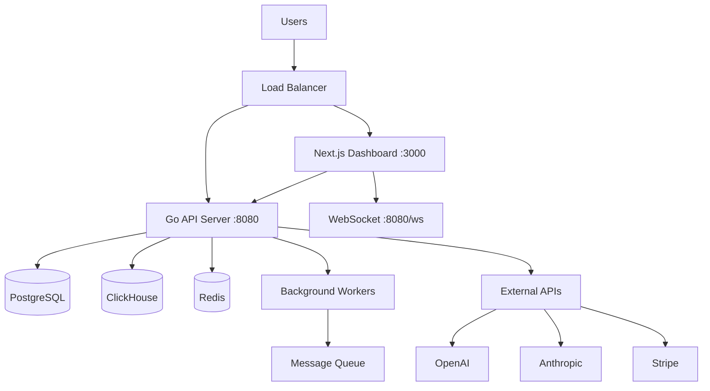

# 🏗️ Brokle Platform Architecture

## Overview

Brokle is designed as a **monolith-first architecture** with microservices-ready patterns. This approach provides simplicity for development and deployment while maintaining the flexibility to extract services as needed for scale.

## System Architecture



## Core Components

### 1. Frontend Layer - Next.js Dashboard

**Purpose**: Server-side rendered dashboard with real-time capabilities

**Key Features**:
- **Server-Side Rendering** - Critical pages rendered on server for performance
- **Real-time Updates** - WebSocket integration for live metrics
- **Heavy Interactions** - Complex state management for analytics
- **Mobile Responsive** - Adaptive UI across devices

**Technology Stack**:
- Next.js 14+ with App Router
- TypeScript for type safety
- Tailwind CSS + shadcn/ui for styling
- Zustand for state management
- React Query for API state
- WebSocket client for real-time features

### 2. Backend Layer - Go Monolith

**Purpose**: Single binary handling all backend operations

**Key Features**:
- **HTTP API Server** - RESTful API with OpenAI compatibility
- **WebSocket Server** - Real-time event streaming
- **Background Workers** - Async job processing via goroutines
- **Multi-Database Support** - PostgreSQL + ClickHouse + Redis

**Technology Stack**:
- Go 1.24+ with net/http + Gorilla Mux
- Gorilla WebSocket for real-time features
- GORM for PostgreSQL operations
- ClickHouse Go client for analytics
- Redis for caching and pub/sub
- golang-migrate for database migrations

### 3. Data Layer - Multi-Database Strategy

#### PostgreSQL - Transactional Data
**Purpose**: ACID transactions, relational data, core business logic

**Tables**:
- `users` - User accounts and profiles
- `organizations` - Multi-tenant organization data
- `auth_sessions` - Authentication sessions and tokens
- `api_keys` - API key management and scoping
- `projects` - Project management and configurations
- `billing_usage` - Usage tracking and billing data
- `routing_providers` - AI provider configurations
- `configs` - Application and feature configurations

#### ClickHouse - Analytical Data
**Purpose**: High-performance time-series analytics and observability

**Tables**:
- `metrics` - Real-time platform metrics
- `events` - Business and system events
- `traces` - Distributed tracing data
- `request_logs` - API request and response logs
- `ai_routing_metrics` - AI provider routing decisions
- `quality_scores` - AI response quality assessments

#### Redis - Caching & Messaging
**Purpose**: High-speed caching, session storage, pub/sub messaging

**Use Cases**:
- Session storage and JWT token caching
- Real-time event pub/sub for WebSocket
- Background job queuing
- Rate limiting and quota management
- Semantic cache for AI responses

## Service Boundaries & Domain Design

### Domain-Driven Design Approach

The monolith is organized using Domain-Driven Design principles:

#### Core Domains

1. **User Domain** (`/internal/core/domain/user/`)
   - User management, profiles, preferences
   - Repository: PostgreSQL users table
   
2. **Organization Domain** (`/internal/core/domain/organization/`)
   - Multi-tenant organization management
   - Repository: PostgreSQL organizations table
   
3. **Auth Domain** (`/internal/core/domain/auth/`)
   - Authentication, authorization, API keys
   - Repository: PostgreSQL auth_sessions, api_keys tables
   
4. **Routing Domain** (`/internal/core/domain/routing/`)
   - AI provider management and routing logic
   - Repository: PostgreSQL routing_providers table
   
5. **Billing Domain** (`/internal/core/domain/billing/`)
   - Usage tracking, invoicing, subscription management
   - Repository: PostgreSQL billing_usage table
   
6. **Config Domain** (`/internal/core/domain/config/`)
   - Application configuration and feature flags
   - Repository: PostgreSQL configs table
   
7. **Observability Domain** (`/internal/core/domain/observability/`)
   - Metrics, events, tracing, analytics
   - Repository: ClickHouse metrics, events, traces tables

### Interface-Based Design

Each domain defines:
- **Entities** - Core business objects
- **Repository Interface** - Data access abstraction
- **Service Interface** - Business logic abstraction

This allows for:
- **Easy Testing** - Mock interfaces for unit tests
- **Future Extraction** - Services can be extracted to microservices
- **Clean Dependencies** - Core business logic independent of infrastructure

## Telemetry Ingestion Architecture

Brokle supports three integration paths for sending observability data:

### Path 1: Brokle SDK (Recommended)

**Direct integration** with built-in batching and retry logic.

```
Application (Brokle SDK) → Brokle API → Redis Streams → Workers → ClickHouse
```

**Characteristics:**
- Latency: ~5-10ms (p99)
- Throughput: ~100K spans/sec
- Best for: Most users, lowest latency

**Documentation**: [Direct SDK Integration](../integrations/direct-sdk.md)

---

### Path 2: Customer-Managed OTEL Collector (Enterprise)

**Customer runs collector** in their infrastructure for advanced processing.

```
Application (OTEL SDK) → Customer's Collector → Brokle API → Redis Streams → Workers → ClickHouse
                                ↓
                        [Datadog, Jaeger, etc.]
```

**Characteristics:**
- Latency: ~50-100ms (p99) - collector batching overhead
- Throughput: ~10K spans/sec per collector
- Best for: Enterprises, multi-backend, compliance needs

**Use cases:**
- Tail-based sampling (95% cost reduction)
- PII scrubbing (GDPR/HIPAA compliance)
- Multi-backend fan-out (Brokle + Datadog + Jaeger)
- Advanced filtering and transformation

**Documentation**: [OTEL Collector Integration](../integrations/opentelemetry-collector.md)

---

### Path 3: Direct OTLP (Vendor-Agnostic)

**Use OpenTelemetry SDK** directly without Brokle SDK.

```
Application (OTEL SDK) → Brokle API → Redis Streams → Workers → ClickHouse
```

**Characteristics:**
- Latency: ~5-10ms (p99)
- Throughput: ~100K spans/sec
- Best for: OTEL-native users, no vendor lock-in

**Documentation**: [Direct OTLP Integration](../integrations/direct-otlp.md)

---

### Why Brokle Doesn't Run a Collector

Brokle uses **Redis Streams** for internal queuing (not OTEL Collector) because:

1. **Lower Latency** - 1 network hop instead of 2
2. **Simpler Operations** - No separate service to manage
3. **Already Running Redis** - No new infrastructure needed
4. **Same Reliability** - Consumer groups provide same guarantees as collector
5. **Better Performance** - Direct integration vs additional hop

**Customer collectors are still supported** - Brokle is OTLP-compatible and works as a backend for any OTEL Collector configuration.

---

### Internal Processing Pipeline

Once data reaches Brokle API (via any path above):

```
Brokle API (OTLP Receiver)
    ↓
TelemetryService
    ↓
Deduplication (ULID, 24h TTL, atomic claim)
    ↓
Redis Streams Producer
    ↓
Stream: telemetry:batches:{project_id}
    ↓
TelemetryStreamConsumer (in-process worker)
    ↓
Process Events (traces, spans, scores)
    ↓
ClickHouse Analytics Database
```

**Key features:**
- ✅ ULID-based deduplication (24h TTL, atomic operations)
- ✅ Redis Streams with consumer groups (horizontal scaling)
- ✅ Dead Letter Queue (DLQ) for failed messages
- ✅ Batch size: 50 events / 1s block (optimized for low latency)
- ✅ In-process consumer (simpler than separate worker service)

---

## Data Flow Patterns

### 1. Request/Response Flow

```
User Request → Next.js SSR → Go API → Domain Service → Repository → Database
                ↓
User Response ← Next.js SSR ← Go API ← Domain Service ← Repository ← Database
```

### 2. Real-time Event Flow

```
System Event → Domain Service → Event Dispatcher → WebSocket Hub → Client
                                        ↓
                               Background Workers → Analytics Storage
```

### 3. Background Processing Flow

```
API Request → Domain Service → Job Queue (Redis) → Background Worker → Database
                    ↓
                Email/Webhook Notification
```

## Real-time Event System

### WebSocket Architecture

**Connection Management**:
- **Hub Pattern** - Central connection manager
- **Room-based Subscriptions** - Users subscribe to relevant data streams
- **Graceful Degradation** - Fallback to polling if WebSocket fails

**Event Types**:
- `metrics.updated` - Live platform metrics
- `usage.threshold` - Billing threshold alerts
- `routing.decision` - AI provider routing changes
- `system.alert` - Critical system notifications

**Scalability Pattern**:
```go
// Current: In-memory hub
WebSocketHub → Local Connections

// Future: Redis pub/sub scaling
WebSocketHub → Redis PubSub → Multiple Server Instances
```

## Background Processing Architecture

### Job Processing Strategy

**Current Implementation**:
- **Goroutine Pool** - Fixed pool of worker goroutines
- **Redis Queue** - Job persistence and distribution
- **Job Types**: Analytics processing, email notifications, webhook deliveries

**Job Categories**:
1. **High Priority** - Real-time notifications, alerts
2. **Medium Priority** - Analytics aggregation, reporting
3. **Low Priority** - Cleanup tasks, archival operations

**Future Scaling**:
- **Horizontal Scaling** - Multiple server instances processing jobs
- **Dead Letter Queues** - Failed job handling and retry logic
- **Job Scheduling** - Cron-like scheduling for recurring tasks

## Security Architecture

### Authentication & Authorization

**Multi-layered Security**:
1. **API Key Authentication** - Service-to-service communication
2. **JWT Token Authentication** - User session management
3. **Role-Based Access Control** - Organization-level permissions
4. **Resource-Level Authorization** - Project and environment scoping

**Security Patterns**:
- **Zero-Trust Architecture** - Verify every request
- **Least Privilege Access** - Minimal required permissions
- **Audit Trails** - Complete action logging in ClickHouse
- **Rate Limiting** - Per-user and per-API-key limits

### Data Security

**Encryption**:
- **At Rest** - Database encryption, encrypted backups
- **In Transit** - TLS 1.3 for all communications
- **Application Level** - Sensitive data field encryption

**Privacy**:
- **Data Minimization** - Collect only necessary data
- **Retention Policies** - Automated data lifecycle management
- **GDPR Compliance** - Right to deletion, data portability

## Performance & Scalability

### Performance Targets

**API Performance**:
- **P95 Response Time** < 200ms for API endpoints
- **P99 Response Time** < 500ms for complex analytics queries
- **WebSocket Latency** < 100ms for real-time updates
- **Database Query Time** < 50ms for hot path queries

**Scalability Targets**:
- **Concurrent Users** - 10,000+ active dashboard users
- **API Throughput** - 10,000+ requests per second
- **WebSocket Connections** - 1,000+ per server instance
- **Background Jobs** - 1,000+ jobs per minute

### Optimization Strategies

**Database Optimization**:
- **Connection Pooling** - Shared connection pools
- **Query Optimization** - Indexed queries, query plans
- **Read Replicas** - Separate read/write workloads
- **Caching Strategy** - Multi-level caching (Redis, in-memory)

**Application Optimization**:
- **Goroutine Pooling** - Controlled concurrency
- **Memory Management** - Efficient data structures
- **CPU Optimization** - Profiling-guided optimizations
- **Network Optimization** - HTTP/2, connection reuse

## Monitoring & Observability

### Metrics Collection

**Application Metrics**:
- **Business Metrics** - User activity, API usage, revenue
- **System Metrics** - CPU, memory, disk, network usage
- **Custom Metrics** - AI routing decisions, quality scores

**Monitoring Stack**:
- **Prometheus** - Metrics collection and querying
- **Grafana** - Dashboards and visualization
- **Jaeger** - Distributed tracing
- **AlertManager** - Alert routing and notifications

### Logging Strategy

**Structured Logging**:
- **JSON Format** - Machine-readable log format
- **Correlation IDs** - Request tracing across services
- **Log Levels** - DEBUG, INFO, WARN, ERROR, FATAL
- **Context Enrichment** - User ID, organization ID, request ID

**Log Aggregation**:
- **Centralized Collection** - All logs in ClickHouse
- **Real-time Search** - Fast log querying and filtering
- **Retention Policies** - Automated log lifecycle management

## Deployment Architecture

### Container Strategy

**Development**:
- **Docker Compose** - Local development environment
- **Hot Reloading** - Air for Go, Next.js dev server
- **Database Seeding** - Automated test data creation

**Production**:
- **Multi-stage Builds** - Optimized container images
- **Health Checks** - Container and application health
- **Resource Limits** - CPU and memory constraints
- **Security Scanning** - Vulnerability assessment

### Kubernetes Deployment

**Production Topology**:
```yaml
# Go API Server
- Deployment: 3+ replicas
- Service: ClusterIP with ingress
- Resources: 2 CPU, 4GB RAM per replica

# Next.js Dashboard  
- Deployment: 2+ replicas
- Service: ClusterIP with ingress
- Resources: 1 CPU, 2GB RAM per replica

# Databases
- PostgreSQL: StatefulSet with persistent storage
- ClickHouse: StatefulSet with persistent storage  
- Redis: Deployment with persistent storage
```

## Future Architecture Evolution

### Microservices Migration Path

**Phase 1**: Extract high-volume domains
- **Analytics Service** - ClickHouse operations
- **Routing Service** - AI provider management

**Phase 2**: Extract business domains
- **Billing Service** - Usage tracking and invoicing
- **Notification Service** - Email and webhook delivery

**Phase 3**: Extract infrastructure services
- **Auth Service** - Authentication and authorization
- **Config Service** - Configuration management

### Technology Roadmap

**Near Term (6 months)**:
- **GraphQL API** - Flexible query interface
- **Event Sourcing** - Immutable event streams
- **CQRS Pattern** - Separate read/write models

**Medium Term (12 months)**:
- **Multi-Region Deployment** - Global availability
- **Edge Computing** - Regional data processing
- **Machine Learning Pipeline** - Automated quality scoring

**Long Term (18+ months)**:
- **Service Mesh** - Advanced networking and security
- **Event-Driven Architecture** - Fully async communication
- **Multi-Modal AI** - Image, audio, video processing

---

This architecture provides a solid foundation for the Brokle platform, balancing simplicity with scalability and maintaining flexibility for future growth.