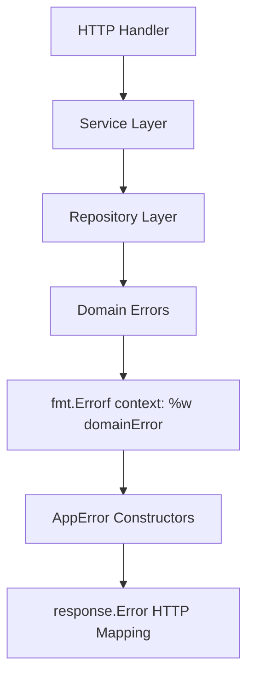

# Industrial Go Error Handling Guide

This document outlines the industrial-grade error handling patterns implemented across the Brokle platform. These patterns ensure clean architecture, proper error propagation, and maintainable code that follows Go best practices.

## Table of Contents

- [Overview](#overview)
- [Architecture Patterns](#architecture-patterns)
- [Domain Alias Pattern](#domain-alias-pattern)
- [Error Handling Flow](#error-handling-flow)
- [Implementation Guidelines](#implementation-guidelines)
- [Examples](#examples)
- [Testing Patterns](#testing-patterns)
- [Troubleshooting](#troubleshooting)

## Overview

The Brokle platform implements a **three-layer clean architecture** with structured error handling that maintains separation of concerns while providing comprehensive error context.

### Key Principles

- **Clean Architecture**: Repository → Service → Handler error flow
- **Domain Separation**: Professional domain alias patterns
- **Structured Errors**: Consistent error wrapping and context
- **Zero Business Logic Pollution**: Cross-cutting concerns handled via decorators
- **Industrial Standards**: Following Go best practices for enterprise applications

### Error Handling Philosophy

```
Repository Layer: Domain errors with context wrapping
Service Layer: AppError constructors for business logic
Handler Layer: HTTP response mapping via response.Error()
```

## Architecture Patterns

### Clean Architecture Error Flow



### Layer Responsibilities

| Layer | Responsibility | Error Pattern | Example |
|-------|---------------|---------------|---------|
| **Repository** | Data access, domain error wrapping | `fmt.Errorf("context: %w", domainError)` | `fmt.Errorf("get user by ID %s: %w", id, userDomain.ErrNotFound)` |
| **Service** | Business logic, AppError constructors | `appErrors.NewNotFoundError()` | `return nil, appErrors.NewNotFoundError("User not found")` |
| **Handler** | HTTP transport, response mapping | `response.Error(c, err)` | Automatic HTTP status code mapping |

## Domain Alias Pattern

### Professional Import Aliasing

All repository files use professional domain alias patterns to avoid naming conflicts and improve code clarity:

```go
// ✅ Correct - Professional domain alias pattern
import (
    "context"
    "fmt"
    
    "gorm.io/gorm"
    
    authDomain "brokle/internal/core/domain/auth"
    "brokle/pkg/ulid"
)

// ❌ Incorrect - Direct domain imports
import (
    "brokle/internal/core/domain/auth"
)
```

### Domain Aliases by Module

| Domain | Alias | Usage |
|--------|-------|--------|
| Authentication | `authDomain` | `authDomain.User`, `authDomain.ErrNotFound` |
| Organization | `orgDomain` | `orgDomain.Organization`, `orgDomain.ErrNotFound` |
| User | `userDomain` | `userDomain.User`, `userDomain.ErrNotFound` |

## Error Handling Flow

### 1. Repository Layer Pattern

Repositories convert database errors to domain errors with context:

```go
// GORM error handling pattern
func (r *userRepository) GetByID(ctx context.Context, id ulid.ULID) (*userDomain.User, error) {
    var user userDomain.User
    err := r.db.WithContext(ctx).Where("id = ?", id).First(&user).Error
    if err != nil {
        if err == gorm.ErrRecordNotFound {
            return nil, fmt.Errorf("get user by ID %s: %w", id, userDomain.ErrNotFound)
        }
        return nil, fmt.Errorf("database query failed for user ID %s: %w", id, err)
    }
    return &user, nil
}
```

### 2. Service Layer Pattern

Services use AppError constructors for business logic errors:

```go
func (s *userService) GetUser(ctx context.Context, id ulid.ULID) (*GetUserResponse, error) {
    user, err := s.userRepo.GetByID(ctx, id)
    if err != nil {
        if errors.Is(err, userDomain.ErrNotFound) {
            return nil, appErrors.NewNotFoundError("User not found")
        }
        return nil, appErrors.NewInternalError("Failed to retrieve user")
    }
    
    return &GetUserResponse{
        User: user,
    }, nil
}
```

### 3. Handler Layer Pattern

HTTP handlers use structured response handling:

```go
func (h *userHandler) GetUser(c *gin.Context) {
    userID := c.Param("id")
    
    resp, err := h.userService.GetUser(c, ulid.MustParse(userID))
    if err != nil {
        response.Error(c, err) // Automatic HTTP status mapping
        return
    }
    
    response.Success(c, resp)
}
```

## Implementation Guidelines

### Repository Layer Requirements

#### ✅ Required Patterns

```go
// 1. Professional domain alias imports
authDomain "brokle/internal/core/domain/auth"

// 2. GORM error checking with domain error wrapping
if err == gorm.ErrRecordNotFound {
    return nil, fmt.Errorf("get user by email %s: %w", email, userDomain.ErrNotFound)
}

// 3. Generic error wrapping with context
return nil, fmt.Errorf("database query failed for email %s: %w", email, err)
```

#### ❌ Prohibited Patterns

```go
// Don't use errors.New in repositories
return nil, errors.New("user not found")

// Don't use errors.Is for GORM errors - use direct comparison
if errors.Is(err, gorm.ErrRecordNotFound) // ❌
if err == gorm.ErrRecordNotFound         // ✅

// Don't use non-aliased domain references
auth.User // ❌
authDomain.User // ✅
```

### Service Layer Requirements

#### ✅ Required Patterns

```go
// 1. AppError constructors for business logic
if errors.Is(err, userDomain.ErrNotFound) {
    return nil, appErrors.NewNotFoundError("User not found")
}

// 2. Structured error context
return nil, appErrors.NewValidationError("Invalid email format", "email")

// 3. Internal errors for unexpected failures
return nil, appErrors.NewInternalError("Failed to process request")
```

#### ❌ Prohibited Patterns

```go
// Don't use fmt.Errorf or errors.New in services
return nil, fmt.Errorf("user not found") // ❌
return nil, errors.New("invalid input")   // ❌

// Don't include logging in core services - use decorators
log.Error("Failed to create user")        // ❌
```

### Handler Layer Requirements

#### ✅ Required Patterns

```go
// 1. Structured response handling
resp, err := h.service.Method(c, req)
if err != nil {
    response.Error(c, err) // Automatic status mapping
    return
}
response.Success(c, resp)

// 2. Input validation before service calls
if err := req.Validate(); err != nil {
    response.Error(c, appErrors.NewValidationError("Invalid request", err))
    return
}
```

## Examples

### Complete CRUD Repository Example

```go
package auth

import (
    "context"
    "fmt"
    
    "gorm.io/gorm"
    
    authDomain "brokle/internal/core/domain/auth"
    "brokle/pkg/ulid"
)

type userRepository struct {
    db *gorm.DB
}

func NewUserRepository(db *gorm.DB) authDomain.UserRepository {
    return &userRepository{db: db}
}

func (r *userRepository) Create(ctx context.Context, user *authDomain.User) error {
    if err := r.db.WithContext(ctx).Create(user).Error; err != nil {
        return fmt.Errorf("create user %s: %w", user.Email, err)
    }
    return nil
}

func (r *userRepository) GetByID(ctx context.Context, id ulid.ULID) (*authDomain.User, error) {
    var user authDomain.User
    err := r.db.WithContext(ctx).Where("id = ?", id).First(&user).Error
    if err != nil {
        if err == gorm.ErrRecordNotFound {
            return nil, fmt.Errorf("get user by ID %s: %w", id, authDomain.ErrNotFound)
        }
        return nil, fmt.Errorf("database query failed for user ID %s: %w", id, err)
    }
    return &user, nil
}

func (r *userRepository) GetByEmail(ctx context.Context, email string) (*authDomain.User, error) {
    var user authDomain.User
    err := r.db.WithContext(ctx).Where("email = ?", email).First(&user).Error
    if err != nil {
        if err == gorm.ErrRecordNotFound {
            return nil, fmt.Errorf("get user by email %s: %w", email, authDomain.ErrNotFound)
        }
        return nil, fmt.Errorf("database query failed for email %s: %w", email, err)
    }
    return &user, nil
}

func (r *userRepository) Update(ctx context.Context, user *authDomain.User) error {
    if err := r.db.WithContext(ctx).Save(user).Error; err != nil {
        return fmt.Errorf("update user %s: %w", user.ID, err)
    }
    return nil
}

func (r *userRepository) Delete(ctx context.Context, id ulid.ULID) error {
    if err := r.db.WithContext(ctx).Delete(&authDomain.User{}, "id = ?", id).Error; err != nil {
        return fmt.Errorf("delete user %s: %w", id, err)
    }
    return nil
}
```

### Complete Service Example

```go
package auth

import (
    "context"
    "errors"
    
    authDomain "brokle/internal/core/domain/auth"
    "brokle/pkg/apperrors"
    "brokle/pkg/ulid"
)

type userService struct {
    userRepo authDomain.UserRepository
}

func NewUserService(userRepo authDomain.UserRepository) authDomain.UserService {
    return &userService{
        userRepo: userRepo,
    }
}

func (s *userService) CreateUser(ctx context.Context, req *CreateUserRequest) (*CreateUserResponse, error) {
    // Validate input
    if err := req.Validate(); err != nil {
        return nil, appErrors.NewValidationError("Invalid user data", err)
    }
    
    // Check for existing user
    existingUser, err := s.userRepo.GetByEmail(ctx, req.Email)
    if err != nil && !errors.Is(err, authDomain.ErrNotFound) {
        return nil, appErrors.NewInternalError("Failed to check existing user")
    }
    if existingUser != nil {
        return nil, appErrors.NewConflictError("User already exists with this email")
    }
    
    // Create user
    user := &authDomain.User{
        ID:    ulid.New(),
        Email: req.Email,
        Name:  req.Name,
    }
    
    if err := s.userRepo.Create(ctx, user); err != nil {
        return nil, appErrors.NewInternalError("Failed to create user")
    }
    
    return &CreateUserResponse{
        User: user,
    }, nil
}

func (s *userService) GetUser(ctx context.Context, id ulid.ULID) (*GetUserResponse, error) {
    user, err := s.userRepo.GetByID(ctx, id)
    if err != nil {
        if errors.Is(err, authDomain.ErrNotFound) {
            return nil, appErrors.NewNotFoundError("User not found")
        }
        return nil, appErrors.NewInternalError("Failed to retrieve user")
    }
    
    return &GetUserResponse{
        User: user,
    }, nil
}
```

### Complete Handler Example

```go
package http

import (
    "github.com/gin-gonic/gin"
    
    authDomain "brokle/internal/core/domain/auth"
    "brokle/pkg/response"
    "brokle/pkg/ulid"
)

type userHandler struct {
    userService authDomain.UserService
}

func NewUserHandler(userService authDomain.UserService) *userHandler {
    return &userHandler{
        userService: userService,
    }
}

func (h *userHandler) CreateUser(c *gin.Context) {
    var req CreateUserRequest
    if err := c.ShouldBindJSON(&req); err != nil {
        response.Error(c, appErrors.NewValidationError("Invalid request body", err))
        return
    }
    
    resp, err := h.userService.CreateUser(c, &req)
    if err != nil {
        response.Error(c, err)
        return
    }
    
    response.Created(c, resp)
}

func (h *userHandler) GetUser(c *gin.Context) {
    userID := c.Param("id")
    id, err := ulid.Parse(userID)
    if err != nil {
        response.Error(c, appErrors.NewValidationError("Invalid user ID", err))
        return
    }
    
    resp, err := h.userService.GetUser(c, id)
    if err != nil {
        response.Error(c, err)
        return
    }
    
    response.Success(c, resp)
}
```

## Testing Patterns

### Repository Testing

```go
func TestUserRepository_GetByID(t *testing.T) {
    db := setupTestDB(t)
    repo := NewUserRepository(db)
    
    // Test not found
    _, err := repo.GetByID(context.Background(), ulid.New())
    assert.True(t, errors.Is(err, userDomain.ErrNotFound))
    
    // Test found
    user := createTestUser(t, db)
    result, err := repo.GetByID(context.Background(), user.ID)
    assert.NoError(t, err)
    assert.Equal(t, user.Email, result.Email)
}
```

### Service Testing

```go
func TestUserService_CreateUser(t *testing.T) {
    mockRepo := &MockUserRepository{}
    service := NewUserService(mockRepo)
    
    // Test successful creation
    req := &CreateUserRequest{
        Email: "test@example.com",
        Name:  "Test User",
    }
    
    mockRepo.On("GetByEmail", mock.Anything, req.Email).Return(nil, userDomain.ErrNotFound)
    mockRepo.On("Create", mock.Anything, mock.AnythingOfType("*auth.User")).Return(nil)
    
    resp, err := service.CreateUser(context.Background(), req)
    assert.NoError(t, err)
    assert.Equal(t, req.Email, resp.User.Email)
    
    // Test user already exists
    mockRepo.On("GetByEmail", mock.Anything, req.Email).Return(&userDomain.User{}, nil)
    
    _, err = service.CreateUser(context.Background(), req)
    assert.True(t, appErrors.IsConflictError(err))
}
```

## Troubleshooting

### Common Issues

#### 1. Compilation Error: "too many arguments"

**Problem**: Service constructor calls in DI container still include audit log repositories.

**Solution**: Remove audit log parameters from service constructors:

```go
// ❌ Before
userService := NewUserService(userRepo, auditRepo)

// ✅ After  
userService := NewUserService(userRepo)
```

#### 2. Import Cycle Errors

**Problem**: Direct domain imports causing circular dependencies.

**Solution**: Use professional domain aliases:

```go
// ❌ Before
import "brokle/internal/core/domain/auth"

// ✅ After
import authDomain "brokle/internal/core/domain/auth"
```

#### 3. Error Wrapping Not Working

**Problem**: Using `errors.Is()` with GORM errors.

**Solution**: Use direct comparison for GORM errors:

```go
// ❌ Before
if errors.Is(err, gorm.ErrRecordNotFound)

// ✅ After
if err == gorm.ErrRecordNotFound
```

### Debugging Tips

1. **Check Error Chain**: Use `errors.Is()` and `errors.As()` to inspect error chains
2. **Verify Domain Errors**: Ensure domain error constants are properly defined
3. **Test Error Propagation**: Write tests that verify error flow through layers
4. **Monitor Context**: Ensure error context is meaningful and actionable

## Best Practices Checklist

### Repository Layer
- [ ] Use professional domain alias imports
- [ ] Convert GORM errors to domain errors with context
- [ ] No `errors.New()` or business logic in repositories
- [ ] All database operations include error context

### Service Layer  
- [ ] Use AppError constructors only
- [ ] Convert domain errors to business errors
- [ ] No logging in core services (use decorators)
- [ ] Validate inputs and provide meaningful error messages

### Handler Layer
- [ ] Use `response.Error()` for all error responses
- [ ] Validate input before calling services
- [ ] No business logic in handlers
- [ ] Return appropriate HTTP status codes

### General
- [ ] All errors include sufficient context
- [ ] Error messages are user-friendly where appropriate
- [ ] Test error scenarios thoroughly
- [ ] Document custom error types and their usage

## Conclusion

This industrial error handling system provides:

- **Consistent Error Flow**: Predictable error propagation through layers
- **Clean Architecture**: Proper separation of concerns
- **Professional Standards**: Following Go best practices
- **Maintainable Code**: Easy to understand, test, and modify
- **Production Ready**: Comprehensive error context and logging

By following these patterns, the Brokle platform maintains high code quality, excellent debugging capabilities, and professional error handling that scales with the application.