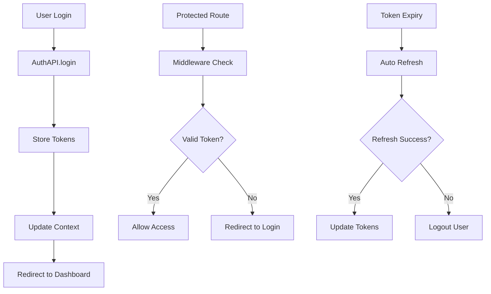

# Brokle Dashboard Development Guide

## 🚀 Overview

This document provides comprehensive guidance for developing and maintaining the Brokle Dashboard - a Next.js 15 App Router application that serves as the frontend interface for The Open-Source AI Control Plane.

## 📁 Project Structure

```
src/
├── app/                    # Next.js 15 App Router
│   ├── (auth)/            # Auth route group
│   ├── (dashboard)/       # Protected dashboard routes
│   ├── middleware.ts      # Route protection middleware
│   └── layout.tsx         # Root layout with providers
├── components/
│   ├── auth/              # Authentication components
│   ├── guards/            # Route and role-based guards
│   ├── providers.tsx      # App-wide providers setup
│   └── ui/                # Reusable UI components
├── context/               # React contexts
├── hooks/
│   ├── api/               # React Query hooks
│   └── auth/              # Authentication hooks
├── lib/
│   ├── api/               # API client architecture
│   │   ├── core/          # Gateway client and utilities
│   │   └── services/      # Service-specific clients
│   ├── auth/              # Authentication utilities
│   └── utils/             # General utilities
├── stores/                # Zustand stores
└── types/                 # TypeScript type definitions
```

## 🔐 Authentication System Architecture

### Core Components

#### 1. Gateway API Client (`/src/lib/api/core/gateway-client.ts`)
- **Purpose**: Base API client for Traefik gateway integration
- **Features**: Circuit breaker, retry logic, automatic token injection
- **Usage**: Extended by service-specific clients

```typescript
// Example service client extending gateway client
export class AuthAPIClient extends GatewayAPIClient {
  constructor() {
    super('/auth') // Maps to /auth/* → auth-service:8101/*
  }
}
```

#### 2. Token Management (`/src/lib/auth/token-manager.ts`)
- **Purpose**: Centralized JWT token management
- **Features**: Auto-refresh, secure storage, expiration handling
- **Storage Strategy**: Memory → localStorage → httpOnly cookies

#### 3. Route Protection (`/middleware.ts`)
- **Purpose**: Next.js middleware for route protection
- **Features**: JWT validation, redirect handling, user context headers

#### 4. Authentication Context (`/src/context/auth-context.tsx`)
- **Purpose**: Global auth state management
- **Features**: User state, auth operations, organization context

### Authentication Flow



## 🛠️ Development Patterns

### 1. API Integration Pattern

**Service-Specific Clients**:
```typescript
// Pattern for creating new service clients
export class NewServiceAPIClient extends GatewayAPIClient {
  constructor() {
    super('/service-path') // Maps to service endpoint
    this.setupServiceSpecificInterceptors()
  }
}
```

**React Query Integration**:
```typescript
// Pattern for service queries and mutations
export function useServiceQuery() {
  return useProtectedQuery(
    ['service', 'data'],
    () => api.service.getData(),
    {
      staleTime: 5 * 60 * 1000,
      retry: 3
    }
  )
}
```

### 2. Form Handling Pattern

**Auth Forms with Suspense**:
```typescript
// All auth forms must be wrapped in AuthFormWrapper for SSR
<AuthFormWrapper>
  <SignInForm />
</AuthFormWrapper>
```

**Form Validation**:
```typescript
// Standard form schema pattern
const formSchema = z.object({
  email: z.string().email('Please enter a valid email address'),
  password: z.string().min(7, 'Password must be at least 7 characters long')
})

// React Hook Form integration
const form = useForm<z.infer<typeof formSchema>>({
  resolver: zodResolver(formSchema),
  defaultValues: { /* ... */ }
})
```

### 3. Route Protection Pattern

**Page-Level Protection**:
```typescript
// Use AuthGuard for role-based protection
<AuthGuard requiredRole="admin" requireEmailVerification>
  <AdminContent />
</AuthGuard>
```

**Component-Level Protection**:
```typescript
// Use useAuthGuard hook for conditional rendering
const { isAuthorized, hasRequiredRole } = useAuthGuard({
  requiredRole: 'admin'
})
```

## 📦 Key Dependencies

### Core Dependencies
- **Next.js 15.4.6**: App Router framework
- **React 19.1.1**: UI library
- **TypeScript ~5.9.2**: Type safety
- **Tailwind CSS 4.1.12**: Styling framework

### Authentication & API
- **@tanstack/react-query 5.59.0**: Server state management
- **jose 5.2.0**: JWT handling
- **zod 4.0.17**: Schema validation
- **react-hook-form 7.62.0**: Form management

### UI Components
- **@radix-ui/***: Headless UI components
- **lucide-react 0.539.0**: Icon library
- **sonner 2.0.7**: Toast notifications

## 🔧 Development Commands

### Setup & Development
```bash
# Install dependencies
pnpm install

# Start development server
pnpm dev

# Build for production
pnpm build

# Type checking
pnpm tsc --noEmit

# Linting
pnpm lint

# Format code
pnpm format
```

### Testing Authentication
```bash
# Start backend services (from project root)
make start

# Start dashboard in parallel
cd web/dashboard && pnpm dev
```

## 🚨 Known Issues & Solutions

### 1. TypeScript Errors
**Issue**: Form validation type mismatches
**Solution**: Update form schemas to match exact TypeScript types

**Issue**: API error type inconsistencies  
**Solution**: Standardize APIError interface across all services

### 2. Build Issues
**Issue**: useSearchParams() SSR errors
**Solution**: Always wrap forms using useSearchParams in Suspense boundaries

**Issue**: Static generation failures
**Solution**: Use dynamic imports for client-only components

### 3. Authentication Issues
**Issue**: Token refresh loops
**Solution**: Implement proper refresh throttling in TokenManager

**Issue**: Cross-tab session sync
**Solution**: Use BroadcastChannel API for real-time sync

## 📋 Development Checklist

### Adding New Pages
- [ ] Create page in appropriate route group `(auth)` or `(dashboard)`
- [ ] Add route protection if needed (middleware handles this)
- [ ] Implement error boundaries for robust error handling
- [ ] Add loading states for better UX
- [ ] Test SSR/static generation compatibility

### Adding New API Endpoints
- [ ] Create service-specific client extending GatewayAPIClient
- [ ] Add TypeScript types for requests/responses
- [ ] Create React Query hooks (useQuery/useMutation)
- [ ] Add error handling and loading states
- [ ] Test with different auth states

### Adding New Components
- [ ] Follow existing component patterns
- [ ] Add proper TypeScript types
- [ ] Implement accessibility features
- [ ] Add error boundaries where appropriate
- [ ] Test with different user roles

### Security Checklist
- [ ] Validate all user inputs
- [ ] Sanitize data before display
- [ ] Use proper CSRF protection
- [ ] Implement rate limiting where needed
- [ ] Test auth flows thoroughly
- [ ] Review token storage security

## 🔮 Future Enhancements

### Short Term (Next 2 Weeks)
1. **Fix TypeScript Issues**: Resolve all type errors for production build
2. **Add Unit Tests**: Implement Jest/Testing Library for components
3. **Error Handling**: Improve error boundaries and fallback UI
4. **Performance**: Implement code splitting and lazy loading

### Medium Term (Next Month)
1. **Multi-Factor Authentication**: Implement 2FA/MFA support
2. **Advanced RBAC**: Extend role-based access control
3. **Audit Logging**: Add comprehensive audit trail
4. **Offline Support**: Implement service worker for offline functionality

### Long Term (Next Quarter)
1. **Mobile App**: React Native version using same API architecture
2. **Advanced Analytics**: User behavior tracking and insights
3. **White Label**: Multi-tenant dashboard customization
4. **Real-time Features**: WebSocket integration for live updates

## 📚 Resources

### Internal Documentation
- Main project: `/CLAUDE.md`
- Architecture docs: `/docs/03-technical-architecture/`
- API docs: `/docs/02-development-standards/`

### External Resources
- [Next.js 15 Documentation](https://nextjs.org/docs)
- [React Query Documentation](https://tanstack.com/query/latest)
- [Tailwind CSS Documentation](https://tailwindcss.com/docs)
- [TypeScript Handbook](https://www.typescriptlang.org/docs/)

## 🤝 Contributing Guidelines

### Code Style
- Use TypeScript for all new code
- Follow existing naming conventions
- Add JSDoc comments for complex functions
- Use meaningful commit messages following project standards

### Pull Request Process
1. Create feature branch from `main`
2. Implement changes following patterns above
3. Add/update tests as needed
4. Ensure TypeScript builds without errors
5. Update this documentation if needed
6. Submit PR with detailed description

### Code Review Checklist
- [ ] TypeScript types are properly defined
- [ ] Authentication is properly handled
- [ ] Error states are handled gracefully
- [ ] Loading states provide good UX
- [ ] Code follows existing patterns
- [ ] Documentation is updated if needed

---

## 💡 Tips for Success

1. **Start Small**: Implement one feature at a time and test thoroughly
2. **Follow Patterns**: Use existing code as examples for new features
3. **Test Auth Flows**: Always test different authentication states
4. **Monitor Performance**: Use React DevTools and Network tab
5. **Stay Updated**: Keep dependencies updated and follow Next.js best practices

This guide should be updated as the dashboard evolves. When adding new features or patterns, please update the relevant sections to help future developers.